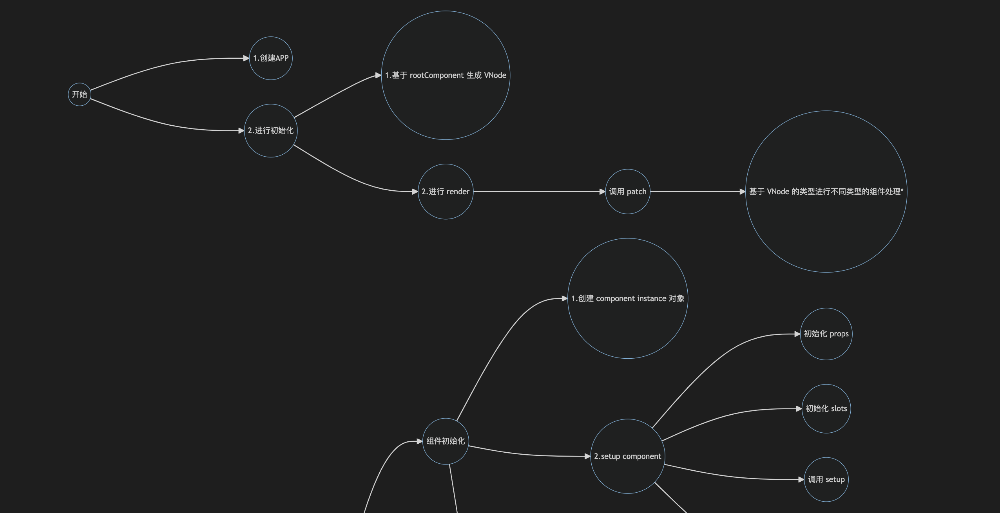
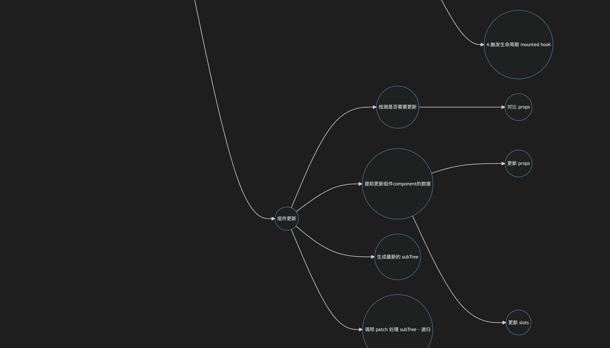

# runtime-core 初始化流程

```mermaid
graph LR;

a((开始))
a1((1.创建APP))
a2((2.进行初始化))
a2-1((1.基于 rootComponent 生成 VNode))
a2-2((2.进行 render))
a2-2-1((调用 patch))
a2-2-1-1((基于 VNode 的类型进行不同类型的组件处理*))
a3-2-1-1((基于 VNode 的类型进行不同类型的组件处理*))
a4-2-1-1((基于 VNode 的类型进行不同类型的组件处理*))
a2-2-1-1-1((处理 shapeFlag & ShapeFlags.COMPONENT 类型))
a2-2-1-1-1-1((组件初始化))
a2-2-1-1-1-1-1((1.创建 component instance 对象))
a2-2-1-1-1-1-2((2.setup component))
a2-2-1-1-1-1-2-1((初始化 props))
a2-2-1-1-1-1-2-2((初始化 slots))
a2-2-1-1-1-1-2-3((调用 setup))
a2-2-1-1-1-1-2-4((设置 render 函数))
a2-2-1-1-1-1-3((3.setupRenderEffect))
a2-2-1-1-1-1-3-1((1.调用 render 函数获取 VNode - 子组件))
a2-2-1-1-1-1-3-2((2.触发生命周期beforeMount hook))
a2-2-1-1-1-1-3-3((3.调用 patch 初始化子组件 - 递归))
a2-2-1-1-1-1-3-4((4.触发生命周期 mounted hook))
a2-2-1-1-1-2((组件更新))
a2-2-1-1-1-2-1((检测是否需要更新))
a2-2-1-1-1-2-1-1((对比 props))
a2-2-1-1-1-2-2((提前更新组件component的数据))
a2-2-1-1-1-2-2-1((更新 props))
a2-2-1-1-1-2-2-2((更新 slots))
a2-2-1-1-1-2-3((生成最新的 subTree))
a2-2-1-1-1-2-4((调用 patch 处理 subTree - 递归))

a2-2-1-1-2((处理 shapeFlag & ShapeFlags.ELEMENT 类型))
a2-2-1-1-2-1((element 初始化))
a2-2-1-1-2-1-1((1.调用 hostCreateElement 函数创建真实的 element))
a2-2-1-1-2-1-2((2.处理 children 节点))
a2-2-1-1-2-1-3((3.调用 hosePatchProp 函数设置元素的 prop))
a2-2-1-1-2-1-4((4.触发 beforeMount 钩子函数))
a2-2-1-1-2-1-5((5.渲染 hostInsert))
a2-2-1-1-2-1-6((6.触发 Mounted 钩子函数))

a2-2-1-1-2-1-2-1((文本类型调用 hostSetElementText函数))
a2-2-1-1-2-1-2-2((数组类型循环调用 patch 函数))

a2-2-1-1-2-1-4-1((VNodeHook - 虚拟节点))
a2-2-1-1-2-1-4-1-1((onVNodeBeforeMount))
a2-2-1-1-2-1-4-2((DirectiveHook - 指令))
a2-2-1-1-2-1-4-2-1((beforeMount))
a2-2-1-1-2-1-4-3((transition - 动画))
a2-2-1-1-2-1-4-3-1((beforeEnter))

a2-2-1-1-2-1-5-1((插入真实的 dom 树))

a2-2-1-1-2-1-6-1((VNodeHook - 虚拟节点))
a2-2-1-1-2-1-6-1-1((onVNodeBeforeMount))
a2-2-1-1-2-1-6-2((DirectiveHook - 指令))
a2-2-1-1-2-1-6-2-1((beforeMount))
a2-2-1-1-2-1-6-3((transition - 动画))
a2-2-1-1-2-1-6-3-1((beforeEnter))

a2-2-1-1-2-2((element 更新))
a2-2-1-1-2-2-1((对比 props))
a2-2-1-1-2-2-2((对比 children))
a2-2-1-1-2-2-2-1((遍历所有的 child 调用 patch - 递归))


a --> a1
a --> a2
a2 --> a2-1
a2 --> a2-2 --> a2-2-1 --> a2-2-1-1

a3-2-1-1 --> a2-2-1-1-1 --> a2-2-1-1-1-1
a2-2-1-1-1-1 --> a2-2-1-1-1-1-1
a2-2-1-1-1-1 --> a2-2-1-1-1-1-2
a2-2-1-1-1-1 --> a2-2-1-1-1-1-3

a2-2-1-1-1-1-2 --> a2-2-1-1-1-1-2-1
a2-2-1-1-1-1-2 --> a2-2-1-1-1-1-2-2
a2-2-1-1-1-1-2 --> a2-2-1-1-1-1-2-3
a2-2-1-1-1-1-2 --> a2-2-1-1-1-1-2-4

a2-2-1-1-1-1-3 --> a2-2-1-1-1-1-3-1
a2-2-1-1-1-1-3 --> a2-2-1-1-1-1-3-2
a2-2-1-1-1-1-3 --> a2-2-1-1-1-1-3-3
a2-2-1-1-1-1-3 --> a2-2-1-1-1-1-3-4

a2-2-1-1-1 --> a2-2-1-1-1-2
a2-2-1-1-1-2 --> a2-2-1-1-1-2-1 --> a2-2-1-1-1-2-1-1
a2-2-1-1-1-2 --> a2-2-1-1-1-2-2
a2-2-1-1-1-2-2 --> a2-2-1-1-1-2-2-1
a2-2-1-1-1-2-2 --> a2-2-1-1-1-2-2-2

a2-2-1-1-1-2 --> a2-2-1-1-1-2-3
a2-2-1-1-1-2 --> a2-2-1-1-1-2-4

a2-2-1-1-2-2 --> a2-2-1-1-2-2-1
a2-2-1-1-2-2 --> a2-2-1-1-2-2-2
a2-2-1-1-2-2-2 --> a2-2-1-1-2-2-2-1

a4-2-1-1 --> a2-2-1-1-2
a2-2-1-1-2 --> a2-2-1-1-2-1
a2-2-1-1-2 --> a2-2-1-1-2-2

a2-2-1-1-2-1 --> a2-2-1-1-2-1-1
a2-2-1-1-2-1 --> a2-2-1-1-2-1-2
a2-2-1-1-2-1 --> a2-2-1-1-2-1-3
a2-2-1-1-2-1 --> a2-2-1-1-2-1-4
a2-2-1-1-2-1 --> a2-2-1-1-2-1-5
a2-2-1-1-2-1 --> a2-2-1-1-2-1-6

a2-2-1-1-2-1-2 --> a2-2-1-1-2-1-2-1
a2-2-1-1-2-1-2 --> a2-2-1-1-2-1-2-2

a2-2-1-1-2-1-4 --> a2-2-1-1-2-1-4-1 --> a2-2-1-1-2-1-4-1-1
a2-2-1-1-2-1-4 --> a2-2-1-1-2-1-4-2 --> a2-2-1-1-2-1-4-2-1
a2-2-1-1-2-1-4 --> a2-2-1-1-2-1-4-3 --> a2-2-1-1-2-1-4-3-1

a2-2-1-1-2-1-5 --> a2-2-1-1-2-1-5-1

a2-2-1-1-2-1-6 --> a2-2-1-1-2-1-6-1 --> a2-2-1-1-2-1-6-1-1
a2-2-1-1-2-1-6 --> a2-2-1-1-2-1-6-2 --> a2-2-1-1-2-1-6-2-1
a2-2-1-1-2-1-6 --> a2-2-1-1-2-1-6-3 --> a2-2-1-1-2-1-6-3-1

a2-2-1-1-1-1-3-3 --> a2-2-1
a2-2-1-1-1-2-4 --> a2-2-1
a2-2-1-1-2-1-2-2 --> a2-2-1
a2-2-1-1-2-2-2-1 --> a2-2-1
```
