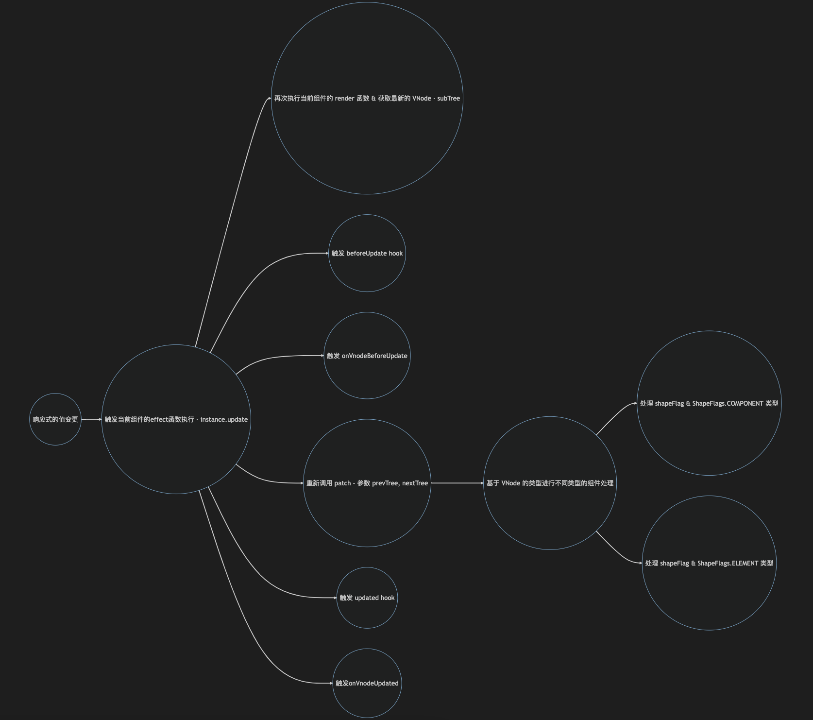
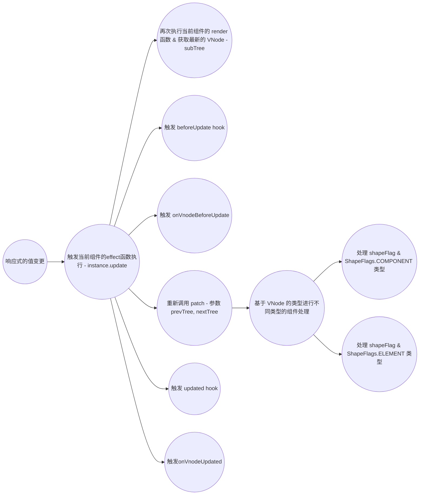

# runtime-core 更新流程

```mermaid
graph LR;

a((响应式的值变更))
b((触发当前组件的effect函数执行 - instance.update))
c1((再次执行当前组件的 render 函数 & 获取最新的 VNode - subTree))
c2((触发 beforeUpdate hook))
c3((触发 onVnodeBeforeUpdate))
c4((重新调用 patch - 参数 prevTree, nextTree ))
c5((触发 updated hook))
c6((触发onVnodeUpdated))

c4-1((基于 VNode 的类型进行不同类型的组件处理))

c4-1-1((处理 shapeFlag & ShapeFlags.COMPONENT 类型))
c4-1-2((处理 shapeFlag & ShapeFlags.ELEMENT 类型))

a --> b

b --> c1
b --> c2
b --> c3
b --> c4
b --> c5
b --> c6

c4 --> c4-1

c4-1 --> c4-1-1
c4-1 --> c4-1-2

```
